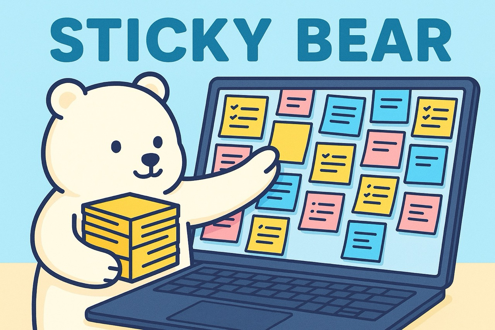

# Sticky Bear

A chrome extension that let user to add always-on-top globally-available sticky notes on browser, and sticky notes that can be pinned to specific location inside any page.

## Features

- [x] Always-on-top sticky notes that float above every webpage.
- [ ] Pin notes to an exact position inside any page – they will re-appear the next time you visit.
- [x] Simple plain-text editing with a lightweight contenteditable.
- [x] Five colour themes per note (yellow, green, blue, red, gray) for quick visual grouping.
- [x] Drag to move or use the resize handle to adjust note size; z-index auto-adjusts so the focused note is always on top.
- [x] Double-click the header to minimise/restore a note, or use the expand button to fit it to its content.
- [x] Global keyboard shortcuts: `Alt+N` to create a new note, `Alt+W` to delete the focused note.
- [x] Smart placement algorithm avoids overlapping existing notes and respects your screen width.
- [x] All notes are saved to `chrome.storage.sync` and synchronised in real-time across every open tab.
- [x] Options page to export/import a JSON backup of all notes or delete everything with one click.
- [x] High-DPI aware – notes keep the same logical size even across monitors with different pixel densities.
